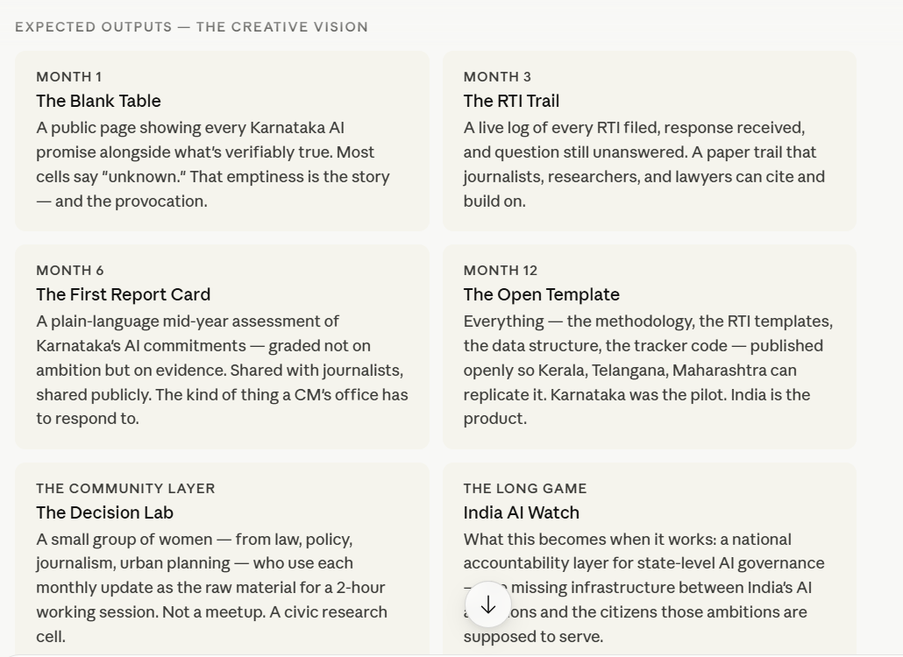

Project Brief · Karnataka AI Watch

India's governments are making billion-rupee AI bets. Nobody is keeping score.

A civic accountability project that makes the invisible visible — tracking what Indian states promise on AI, what they actually do, and who gets left out of both.

The challenge

India's state governments are racing to become "AI-ready" — Karnataka alone has committed  **₹50 crore to a Centre for Applied AI** , promised AI in every classroom, and declared Bengaluru the deep tech capital of South Asia. Meanwhile, **no public body tracks whether any of it happens.** Policies launch with press conferences and die in PDF graveyards. No progress metrics. No advisory board disclosures. No accountability to the citizens funding it. The gap between announcement and reality is total — and completely invisible.

"The most dangerous AI policy is the one nobody is watching."

The inspiration

This project was born from a single moment of frustration: reading Karnataka's new AI policy and finding **nothing but buzzwords where the substance should be.** "Deep tech capital." "AI-driven governance." "25,000 startups." But no baselines, no timelines, no names, no measures of success. The same frustration that a mayor in Phoenix might feel signing a data centre deal without understanding its water cost — or a student in Kalaburagi trying to understand what "AI in education" means for her specifically. **Across every scale, the people with power to decide and the people with knowledge to decide well are in different rooms.** This project tries to unlock that door.

How we do it — the method

Three tools, used together:

**Public records + RTI.** File Right to Information requests for budget utilisation, advisory board composition, and project deliverables. Document what's answered, what's ignored, and what's stonewalled — because the silence is data too.

**AI-assisted analysis.** Use LLMs and data tools to parse policy documents, compare promises against procurement records, and surface discrepancies that would take weeks to find manually. Make the methodology open so anyone can replicate it for their state.

**Plain language publishing.** Every finding gets translated into a format a non-technical person — a journalist, a student, a local councillor — can actually use. Not a research paper. A living page that updates monthly and says honestly: here's what we know, here's what we don't, here's what we asked.

Why this, why now, why you

India has 28 states each making AI promises with public money and zero public accountability infrastructure.

Kerala just created India's first cabinet-level AI ministry. Karnataka's new CM has made AI in education his first promise. The policy moment is live — right now.

No Indian equivalent of The Markup, IndiaSpend, or ProPublica exists for AI governance specifically.

You are a builder who can analyse policy documents with AI, file RTIs, visualise data, and translate findings into plain language — all at once. That combination is rare.

You're 27, based in Bengaluru, working in AI daily, and confused

 about the right things. That's not a liability. That's the qualification.

"We don't need more AI policy. We need someone watching the ones we already have."
